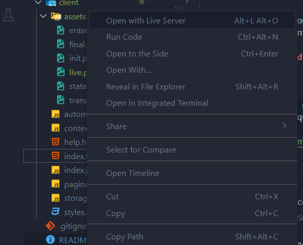

# Editor de Autômatos

Este projeto fornece uma API REST e Client para gerenciar, minimizar, testar equivalencia e testar cadeias de (Autômatos Finitos). Ele usa FastAPI para lidar com solicitações e operações em autômatos e um client em HTML5, CSS3 e JS para interação com usuário.
##
## Pré-requisitos

- Python 3.12.4 ou superior

## Instalação

1. **Clone o repositório**:

    ```sh
    git clone <repository-url>
    cd <repository-directory>
    ```

## Rodando o Backend

2. **Rodando a API (Windows)**:
    ``` 
    ./run.bat
    ```

2. **Rodando a API (Unix)**:
    ``` 
    chmod +x run.sh
    ./run.sh
    ```
    Caso não rode no UNIX, siga os passos abaixo, um por um:
    ```
    cd backend
    python3 -m venv venv
    source venv/bin/activate
    pip install -r requirements.txt
    fastapi dev main.py
    ```

3. **Acesse a API**:

    Abra seu navegador e navegue até `http://127.0.0.1:8000/docs` para ver a documentação interativa da API fornecida pelo FastAPI.

## Rodando o frontend

4. **Live Server**

    Acesse o vscode, na aba de extensões e instale a extensão live server, 
    

    após vá até o arquivo index.html, clique sobre ele com botão direito e vá na opção para 'Open with Live Server'
    
    

    Após, basta ultilizar da ferramenta, em caso de dúvida, basta acessar a aba Tutorial no menu da aplicação!
